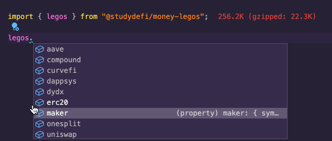
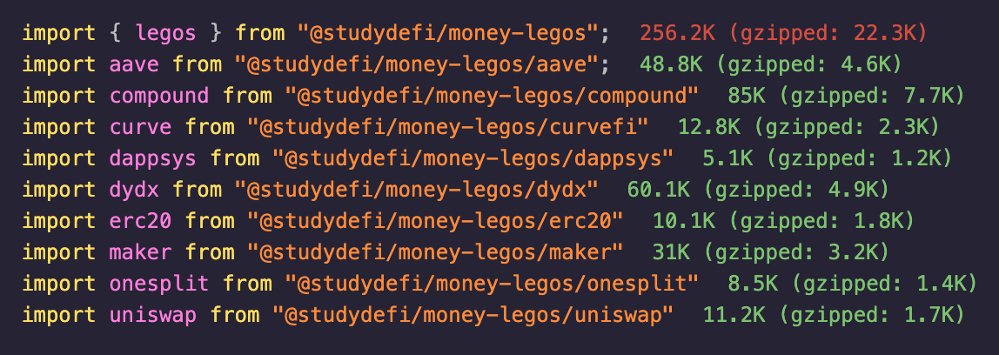

# money-legos

[](https://app.circleci.com/pipelines/github/studydefi/money-legos)
[](https://www.npmjs.com/package/@studydefi/money-legos)




> Get **ABIs**, **Addresses**, and **Solidity Interfaces** to popular DeFi protocols

**Now with Typescript-powered autocomplete!**

`money-legos` is an NPM package that provides you with the **mainnet addresses**, **ABIs**, and **Solidity interfaces** for popular DeFi protocols.

### Click [here](https://money-legos.studydefi.com/) for docs and visit our Discord [here](https://discord.gg/rBr3U32)!

Protocols supported:

- AAVE
- Compound
- Curve Finance
- DappSys
- DyDx
- ERC20
- Idle V3
- Kyber.Network
- MakerDAO
- OneSplit
- UMA Protocol
- Uniswap v1
- Synthetix

Importing specific protocols is also supported:



## Install

```bash
npm install @studydefi/money-legos
```

## Usage

### JavaScript

```javascript
import { legos } from "@studydefi/money-legos";

// access ABIs and addresses
legos.erc20.abi;
legos.erc20.dai.address;

// of many popular DeFi protocols
legos.uniswap.factory.abi;
legos.uniswap.factory.address;

// import only the protocol you are interested in
import uniswap from "@studydefi/money-legos/uniswap";

uniswap.factory.abi;
uniswap.factory.address;
```

### Solidity

```solidity
pragma solidity ^0.5.0;

import "@studydefi/money-legos/onesplit/contracts/IOneSplit.sol";

import "@openzeppelin/contracts/token/ERC20/IERC20.sol";


contract OneSplitSwapper {
    // Uniswap Mainnet factory address
    address constant OneSplitAddress = 0xC586BeF4a0992C495Cf22e1aeEE4E446CECDee0E;

    function _swap(address from, address to, uint256 amountWei) internal {
        IERC20 fromIERC20 = IERC20(from);
        IERC20 toIERC20 = IERC20(to);

        (uint256 returnAmount, uint256[] memory distribution) = IOneSplit(
            OneSplitAddress
        ).getExpectedReturn(
            fromIERC20,
            toIERC20,
            amountWei,
            10,
            0
        );

        IOneSplit(OneSplitAddress).swap(
            fromIERC20,
            toIERC20,
            amountWei,
            returnAmount,
            distribution,
            0
        );
    }
}
```
